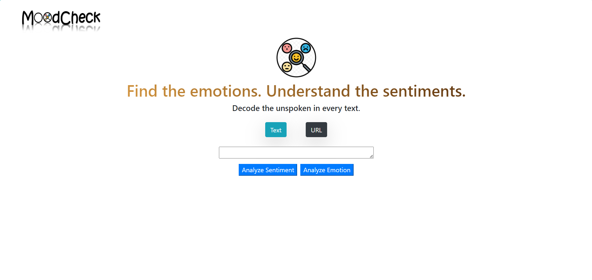

# MoodCheck App

MoodCheck is a web application that utilizes IBM Watson's Natural Language Understanding service to analyze the emotion and sentiment of text content from URLs or direct text input. It provides valuable insights into the emotional tone and sentiment of text, helping users better understand the content they analyze.

## Screenshot



## Table of Contents

- [Key Features](#key-features)
- [Prerequisites](#prerequisites)
- [Installation](#installation)
- [Usage](#usage)
- [Endpoints](#endpoints)
- [License](#license)

---

## Key Features

- Analyze the emotion and sentiment of text content from both URLs and direct text input.
- Provides insights into the emotional tone and sentiment, helping users gauge the mood of the content.
- Easy-to-use RESTful API endpoints for integration with other applications.
- Utilizes IBM Watson's Natural Language Understanding service for accurate analysis.
- Web server serves static content for a seamless user experience.

---

## Prerequisites

Before you begin, ensure you have met the following requirements:

- [Node.js](https://nodejs.org/) installed on your local machine.
- An IBM Watson Natural Language Understanding API key and service URL. Refer to the [IBM Watson documentation](https://cloud.ibm.com/apidocs/natural-language-understanding?code=node#features-examples) for details on obtaining these credentials.

---

## Installation

To install and run the MoodCheck app on your local system, follow these steps:

1. Clone the MoodCheck repository to your local machine:

    ```bash
    git clone https://github.com/chesahkalu/moodcheck.git
    ```

2. Navigate to the project directory:

    ```bash
    cd moodcheck
    ```

3. Install the project dependencies using npm or yarn; on the command line, in the /moodcheck/moodCheckServer `and` /moodcheck/moodCheckClient directories run:

    ```bash
    npm install
    # or
    yarn install
    ```

4. Create a .env file in the project root directory and add your IBM Watson Natural Language Understanding API credentials:

    ```env
    API_KEY=your_api_key
    API_URL=your_api_url
    ```

    Replace `your_api_key` and `your_api_url` with your actual credentials.

5. Start the MoodCheck; on the command line, in the /moodcheck/moodCheckServer directory run:

    ```bash
    npm start
    ```


---

## Usage

The server should now be running locally on port 8080. You can now access the MoodCheck web app at http://localhost:8080 on your browser.
If the port is already in use, you can change it in the /moodcheck/moodCheckServer/moodCheckerServer.js file on line 183.

### API Endpoints

You can use the MoodCheck app to analyze the emotion and sentiment of text content using the following API endpoints:

- **Analyze Emotion from a URL**:

    ```bash
    GET /url/emotion?url=<URL_TO_ANALYZE>
    ```

- **Analyze Sentiment from a URL**:

    ```bash
    GET /url/sentiment?url=<URL_TO_ANALYZE>
    ```

- **Analyze Emotion from Text**:

    ```bash
    GET /text/emotion?text=<TEXT_TO_ANALYZE>
    ```

- **Analyze Sentiment from Text**:

    ```bash
    GET /text/sentiment?text=<TEXT_TO_ANALYZE>
    ```

Replace `<URL_TO_ANALYZE>` and `<TEXT_TO_ANALYZE>` with the URL or text you want to analyze.

Example usage:

- Analyze emotion from a URL:

    ```bash
    GET http://localhost:8080/url/emotion?url=https://example.com
    ```

    or with curl on the command line:

    ```bash
    curl http://localhost:8080/url/emotion?url=https://example.com
    ```

- Analyze sentiment from text:

    ```bash
    GET http://localhost:8080/text/sentiment?text=Hello, I am feeling great today!
    ```

    or with curl on the command line:

    ```bash
    curl http://localhost:8080/text/sentiment?text=Hello, I am feeling great today!
    ```

    
---

## License

This project is licensed under the Apache License, Version 2.0. Please refer to the [LICENSE](./LICENSE) file in the parent folder for more details.

---
